# Manual de usuario — AutoInfra

## 1. Introducción

AutoInfra es una aplicación web para editar archivos con extensión `.infra` y analizar su contenido mediante un Backend de Node.js. La aplicación permite crear y abrir archivos, editar código, descargarlo desde el navegador y consultar los resultados del análisis léxico y sintáctico.

En el alcance actual del proyecto, el botón principal es **Analizar**. El sistema no ejecuta ni simula infraestructura: no existe Interpreter, motor de ejecución, tabla de símbolos, estado final de infraestructura ni bitácora. Los resultados disponibles para el usuario son:

- resumen del análisis;
- errores léxicos y sintácticos;
- tabla de tokens;
- visualización gráfica del AST (árbol de sintaxis abstracta), cuando está disponible.

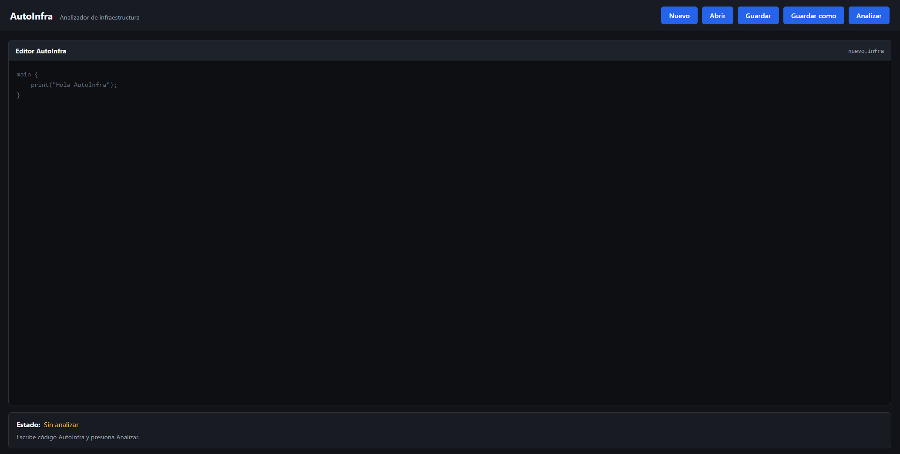

---

## 2. Requisitos para utilizar la aplicación

Para utilizar AutoInfra localmente se necesita:

- Node.js con npm instalado;
- un navegador web moderno;
- el proyecto AutoInfra con sus carpetas `Backend` y `Frontend`;
- dos terminales, una para ejecutar el Backend y otra para el Frontend.

El proyecto no fija una versión exacta de Node.js en sus archivos de configuración. Debe utilizarse una versión compatible con las dependencias instaladas por npm.

El Backend utiliza el puerto `3000` de acuerdo con su configuración actual. El Frontend se conecta a:

```text
http://localhost:3000/analizar
```

---

## 3. Inicio de Backend y Frontend

### 3.1 Iniciar el Backend

Abra una terminal en la carpeta `Backend` e instale sus dependencias:

```bash
npm install
```

Después inicie el servidor:

```bash
npm run dev
```

El Backend debe quedar disponible en el puerto `3000`.

> Para utilizar la interfaz, el Backend debe permanecer encendido mientras se realizan análisis.

### 3.2 Iniciar el Frontend

Abra una segunda terminal en la carpeta `Frontend` e instale sus dependencias:

```bash
npm install
```

Después ejecute:

```bash
npm run dev
```

Vite mostrará en la terminal la dirección local del Frontend. Abra esa dirección en el navegador.

---

## 4. Vista general de la interfaz

La interfaz está organizada alrededor de tres áreas principales:

1. **Barra superior de acciones.** Muestra el nombre **AutoInfra**, el texto **Analizador de infraestructura** y los botones `Nuevo`, `Abrir`, `Guardar`, `Guardar como` y `Analizar`.
2. **Editor AutoInfra.** Contiene el código fuente y muestra el nombre del archivo actual en la parte superior del editor.
3. **Estado y resultados.** Debajo del editor se muestra el estado del análisis. Después de analizar aparecen el resumen, la tabla de errores, la tabla de tokens y la visualización del AST.

Mientras existe un análisis en curso, los botones de la barra superior permanecen deshabilitados y el botón de análisis muestra **Analizando...**.

---

## 5. Editor de código

El panel **Editor AutoInfra** es el área donde se escribe o modifica el código del archivo `.infra`.

Al iniciar la aplicación, el archivo se identifica como:

```text
nuevo.infra
```

El editor admite texto plano de AutoInfra y tiene la corrección ortográfica del navegador desactivada para evitar marcas propias de un editor de texto convencional.

Cuando el usuario modifica el contenido después de haber realizado un análisis:

- los resultados anteriores se ocultan inmediatamente;
- el estado vuelve a **Sin analizar**;
- cualquier mensaje de error de comunicación anterior desaparece.

Esto evita mostrar resultados que ya no correspondan al código visible en el editor.

---

## 6. Crear un archivo nuevo

Para comenzar un archivo vacío:

1. Presione **Nuevo**.
2. El editor se limpiará.
3. El nombre mostrado volverá a `nuevo.infra`.
4. El estado quedará como **Sin analizar**.
5. Cualquier resultado de un análisis anterior desaparecerá.

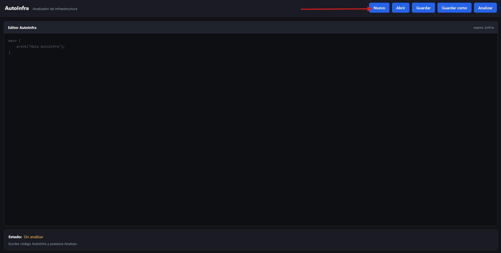

> La opción **Nuevo** modifica el contenido actual del editor. Si desea conservar el contenido anterior, use **Guardar** o **Guardar como** antes de crear el nuevo archivo.

---

## 7. Abrir un archivo `.infra`

Para abrir un archivo existente:

1. Presione **Abrir**.
2. El navegador mostrará el selector de archivos.
3. Seleccione un archivo con extensión `.infra`.
4. Su contenido se cargará en el editor.
5. El nombre real del archivo aparecerá en el encabezado del editor.
6. El estado quedará como **Sin analizar** hasta presionar **Analizar**.

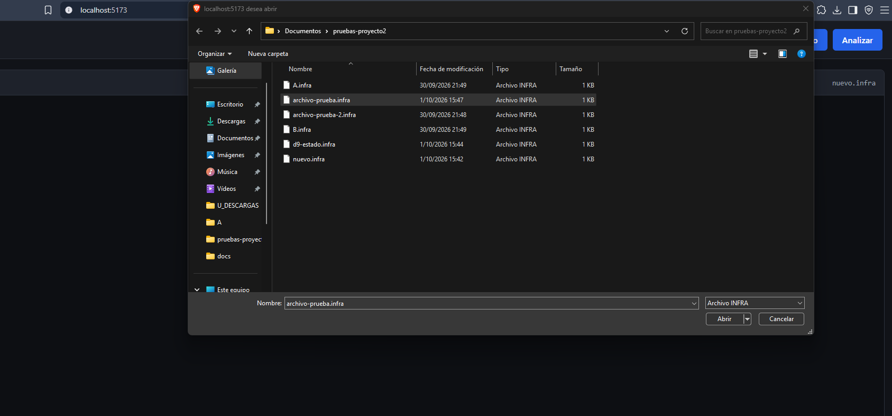

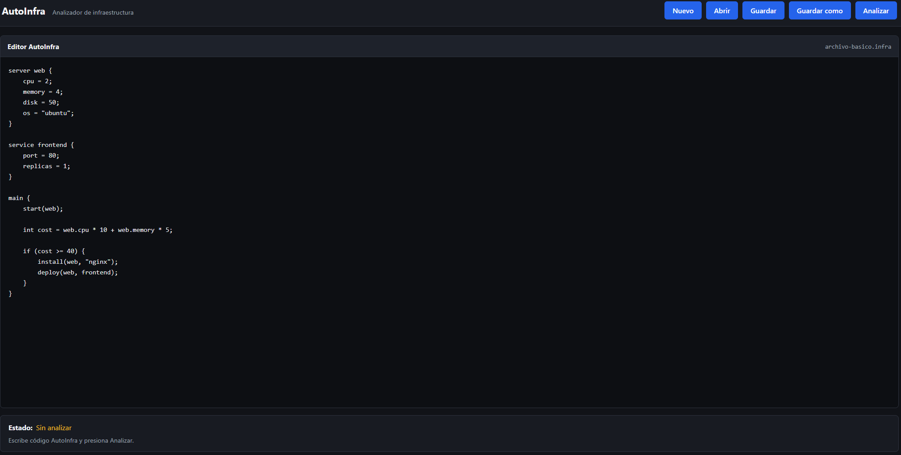

AutoInfra solo acepta archivos cuyo nombre termine en `.infra`. Si se intenta cargar otro tipo de archivo, la aplicación muestra el mensaje:

```text
Solo se pueden abrir archivos con extensión .infra.
```

Si se abre el selector y se cancela sin elegir un archivo, la aplicación conserva el contenido y estado actuales.

---

## 8. Guardar

El botón **Guardar** descarga el contenido actual del editor utilizando el nombre de archivo que se muestra en la interfaz.

Procedimiento:

1. Verifique el nombre actual mostrado en el editor.
2. Presione **Guardar**.
3. El navegador descargará una copia del contenido como archivo.

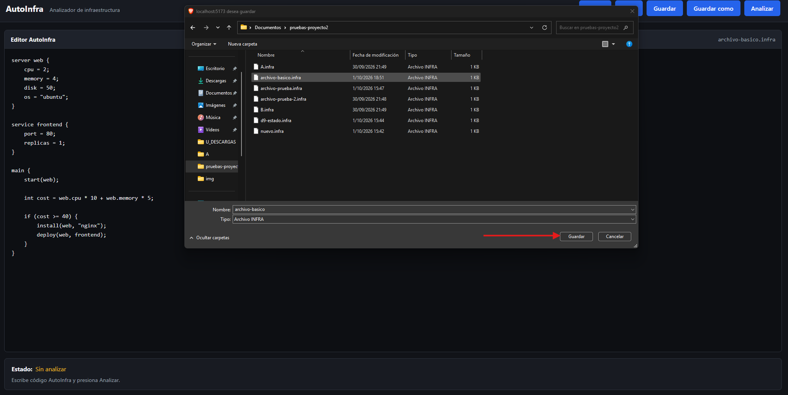

### Comportamiento importante

**Guardar no sobrescribe físicamente el archivo original que fue abierto.** La aplicación crea una descarga desde el navegador con el nombre actual.

Guardar tampoco elimina ni invalida los resultados del análisis que estén visibles, porque no modifica el contenido del editor.

---

## 9. Guardar como

**Guardar como** permite descargar el contenido utilizando otro nombre.

1. Presione **Guardar como**.
2. Aparecerá el cuadro **Nombre del archivo:** con el nombre actual como valor inicial.
3. Escriba el nuevo nombre.
4. Confirme el cuadro.
5. La aplicación descargará el archivo.
6. El nuevo nombre quedará mostrado como nombre actual del archivo en la interfaz.

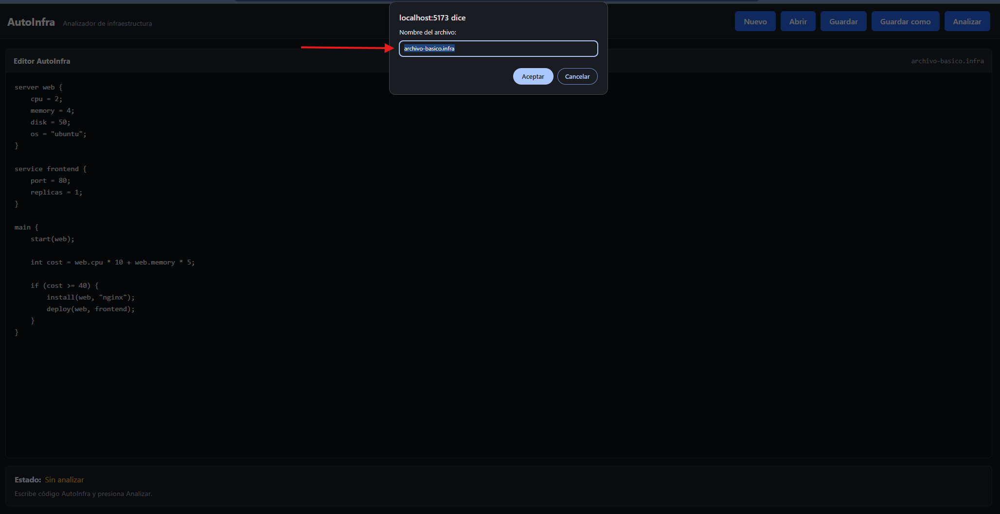

Si el nombre ingresado no termina en `.infra`, la aplicación agrega automáticamente la extensión.

Por ejemplo:

```text
configuracion
```

se normaliza como:

```text
configuracion.infra
```

Si se deja el nombre vacío, la aplicación muestra:

```text
El nombre del archivo no puede estar vacío.
```

Si se cancela el cuadro de nombre, no se realiza ninguna descarga ni se cambia el nombre actual.

---

## 10. Analizar código

Para analizar el código presente en el editor:

1. Asegúrese de que el Backend esté encendido.
2. Escriba o abra el código `.infra` que desea revisar.
3. Presione **Analizar**.
4. El estado cambia temporalmente a **Analizando** y aparece el texto **Esperando respuesta del Backend.**
5. Los resultados anteriores se eliminan mientras se procesa la nueva solicitud.
6. Cuando el Backend responde correctamente, el estado cambia a **Análisis completado**.
7. Debajo aparecen los resultados correspondientes exclusivamente al código analizado en ese momento.

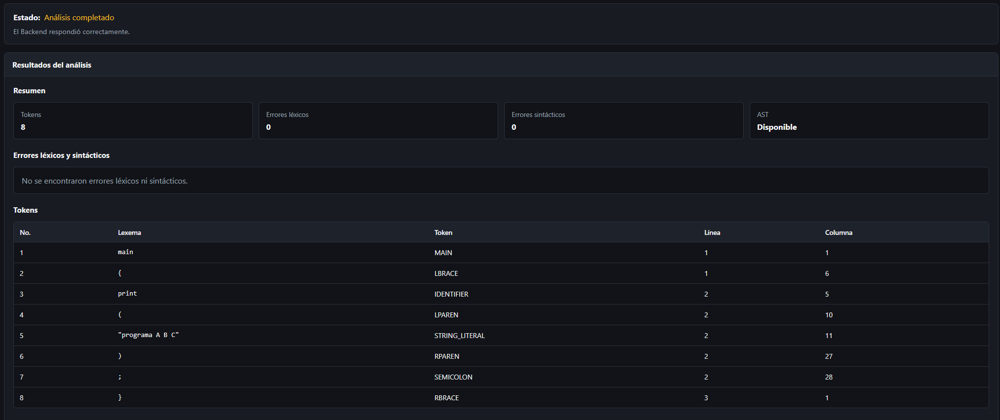

### Análisis no significa ejecución

El análisis reconoce la estructura léxica y sintáctica del código y construye el AST cuando es posible. No ejecuta las instrucciones de AutoInfra ni modifica un estado simulado de infraestructura.

Por ejemplo, una llamada escrita como:

```infra
start(backend);
```

puede ser reconocida sintácticamente como una llamada, pero esta versión de AutoInfra no inicia un servidor ni simula ese efecto.

---

## 11. Estado y resumen del análisis

El panel de estado puede presentar cuatro situaciones:

| Estado | Significado |
|---|---|
| **Sin analizar** | El código actual todavía no tiene resultados vigentes. |
| **Analizando** | El Frontend está esperando la respuesta del Backend. |
| **Análisis completado** | El Backend respondió correctamente y existen resultados para mostrar. |
| **Error de comunicación** | La solicitud no pudo completarse correctamente. |

Un análisis puede figurar como **Análisis completado** y al mismo tiempo contener errores léxicos o sintácticos. Esto significa que el Backend terminó correctamente el proceso de análisis; los errores del código se consultan en el reporte correspondiente.

### Resumen

Después de una respuesta válida aparece el apartado **Resumen**, con cuatro valores:

- **Tokens:** cantidad de tokens reportados;
- **Errores léxicos:** cantidad detectada;
- **Errores sintácticos:** cantidad detectada;
- **AST:** `Disponible` o `No disponible`.

Los valores corresponden únicamente al análisis actual.

---

## 12. Tabla de errores

El apartado **Errores léxicos y sintácticos** presenta los problemas detectados durante el análisis.

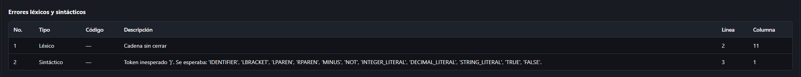

La tabla muestra:

| Columna | Contenido |
|---|---|
| **No.** | Número de fila del reporte. |
| **Tipo** | `Léxico` o `Sintáctico`. |
| **Código** | Código del error cuando existe. En la versión actual normalmente se muestra `—`. |
| **Descripción** | Explicación del error detectado. |
| **Línea** | Línea donde se reportó el problema. |
| **Columna** | Columna donde se reportó el problema. |

Si no existen errores, la aplicación muestra:

```text
No se encontraron errores léxicos ni sintácticos.
```

### Ejemplo para observar errores

Puede utilizar un archivo como:

```infra
main {
    int x = ;
    @
    print("continua");
}
```

Este ejemplo permite observar un error sintáctico y un carácter no reconocido reportado como error léxico. El objetivo del reporte es mostrar la ubicación de los problemas y permitir que el usuario corrija el código antes de volver a analizarlo.

---

## 13. Tabla de tokens

El apartado **Tokens** muestra los elementos léxicos reconocidos en el código fuente.

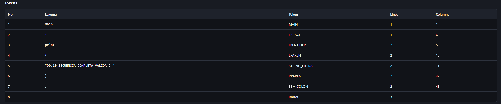

Las columnas son:

| Columna | Contenido |
|---|---|
| **No.** | Número de fila. |
| **Lexema** | Texto que apareció en el archivo. |
| **Token** | Categoría reconocida por el analizador. |
| **Línea** | Línea del lexema. |
| **Columna** | Columna inicial del lexema. |

La tabla respeta el orden en que los tokens fueron reconocidos en el archivo.

Si no existen tokens para mostrar, aparece:

```text
No se encontraron tokens.
```

---

## 14. Visualización gráfica del AST

El apartado **Árbol de sintaxis abstracta** muestra una representación gráfica del AST generado por el Backend.

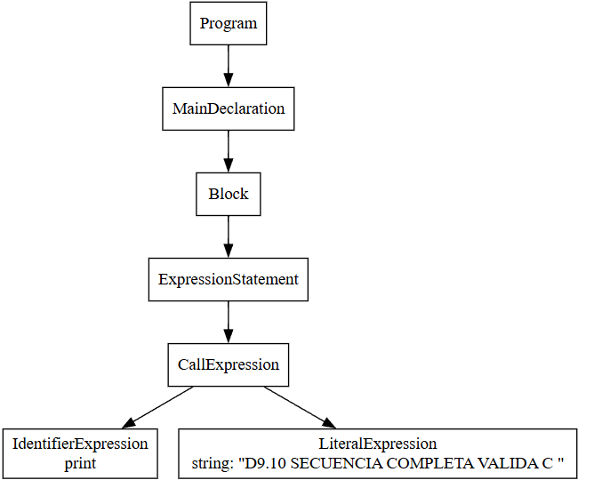

El Frontend recibe el SVG ya generado por el Backend y lo muestra dentro de un área desplazable. El navegador no reconstruye por su cuenta la estructura del árbol.

El gráfico representa la estructura sintáctica del programa, por ejemplo declaraciones, bloques, expresiones y llamadas reconocidas por el parser.

Si el análisis no produce un AST disponible, la interfaz muestra:

```text
No hay un AST disponible para este análisis.
```

---

## 15. Ejemplo completo de uso

El siguiente ejemplo permite recorrer el flujo normal de la aplicación sin depender de ejecución o simulación:

```infra
main {
    int numero = 25;
    print("Valor: " + numero);
}
```

### Paso 1 — Crear o abrir el archivo

Presione **Nuevo** y escriba el ejemplo en el editor, o guárdelo previamente como un archivo `.infra` y ábralo mediante **Abrir**.

### Paso 2 — Guardar el código

Puede utilizar **Guardar** para descargarlo con el nombre actual, o **Guardar como** para asignarle un nombre como:

```text
ejemplo.infra
```

### Paso 3 — Analizar

Presione **Analizar**.

Durante la solicitud, el estado será **Analizando**. Después de una respuesta correcta pasará a **Análisis completado**.

### Paso 4 — Revisar el resumen

Compruebe:

- cantidad de tokens;
- cero errores léxicos si el código fue copiado correctamente;
- cero errores sintácticos si el código fue copiado correctamente;
- disponibilidad del AST.

### Paso 5 — Revisar reportes

Desplácese por **Errores léxicos y sintácticos**, **Tokens** y **Árbol de sintaxis abstracta**.

Las capturas de las secciones anteriores muestran los mismos tipos de resultados que deben revisarse en este flujo.

---

## 16. Reportes disponibles

La aplicación ofrece los siguientes reportes al usuario:

| Reporte | Información mostrada |
|---|---|
| **Errores léxicos y sintácticos** | Tipo, descripción, línea y columna del problema; además incluye las columnas de número y código. |
| **Tokens** | Lexema, categoría del token, línea y columna. |
| **AST gráfico** | Representación SVG del árbol de sintaxis abstracta generado por el Backend. |

El panel **Resumen** complementa estos reportes mostrando sus cantidades principales y la disponibilidad del AST.

No existen en esta versión reportes de:

- tabla de símbolos;
- análisis semántico;
- estado final de infraestructura;
- bitácora de ejecución;
- resultados de simulación.

---

## 17. Errores y situaciones comunes

### 17.1 El Backend no está disponible

Si el Frontend no puede completar la petición, el estado cambia a **Error de comunicación** y se muestra el mensaje correspondiente.

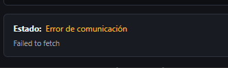

Para resolverlo:

1. compruebe que la terminal del Backend siga abierta;
2. compruebe que se haya ejecutado `npm run dev` en `Backend`;
3. compruebe que el Backend esté usando el puerto `3000`;
4. vuelva a presionar **Analizar** una vez restablecido el servicio.

No es necesario recargar el Frontend para volver a intentar el análisis.

### 17.2 El código contiene errores léxicos o sintácticos

Que el estado muestre **Análisis completado** no significa necesariamente que el código no contenga errores. Consulte:

- el contador de errores del resumen;
- la tabla **Errores léxicos y sintácticos**;
- las columnas de línea y columna.

Corrija el código y vuelva a presionar **Analizar**.

### 17.3 Los resultados desaparecen al editar

Es el comportamiento esperado. Cualquier modificación del código invalida el análisis previo y devuelve la aplicación al estado **Sin analizar**.

### 17.4 No se puede abrir un archivo

Verifique que su extensión sea `.infra`. La aplicación rechaza otros tipos de archivo.

### 17.5 Guardar no modifica el archivo original

Es el comportamiento esperado. **Guardar** y **Guardar como** producen una descarga mediante el navegador. Si abrió un archivo existente y luego lo editó, guardar crea una nueva descarga; no escribe directamente sobre el archivo original del sistema.

### 17.6 No aparece el AST

El AST solo se muestra cuando el Backend entrega un SVG para el análisis actual. Si no está disponible, la interfaz muestra el mensaje correspondiente en el apartado del árbol.

---
